# Maquettes UI/UX - Applications Carlinq

Carlinq, ce sont **deux applications distinctes**, publiées séparément sur les stores
(cahier des charges v1.2, §5.1 et §5.2) :

| App | Dossier | Package Android | Public |
|---|---|---|---|
| **Carlinq** | `passager/` | `com.carlinq.passager` | Passagers |
| **Carlinq Chauffeur** | `chauffeur/` | `com.carlinq.chauffeur` | Chauffeurs **Drivers** (affiliés) et **Copilote** (indépendants, sociétés) |

Le code commun (thème, modèles, carte, arrêts, chat, notifications) vit dans le package
`carlinq_core/`. Toutes les maquettes sont navigables sans backend (données démo du contexte
camerounais, montants entiers en XAF).

Les captures sont générées automatiquement (téléphone 360 × 780 dp, polices Roboto réelles),
depuis chaque app :

```bash
cd passager   # puis cd ../chauffeur
flutter test test/maquettes_test.dart --dart-define=MAQUETTES=true --update-goldens
```

> La carte est un composant `FakeMap` (placeholder) qui sera remplacé par Google Maps en Phase MVP.

# App Passager - Carlinq (`passager/`)

## Entrée dans l'app

| Écran | Fichier | Capture |
|---|---|---|
| Bienvenue | `features/auth/welcome_screen.dart` | 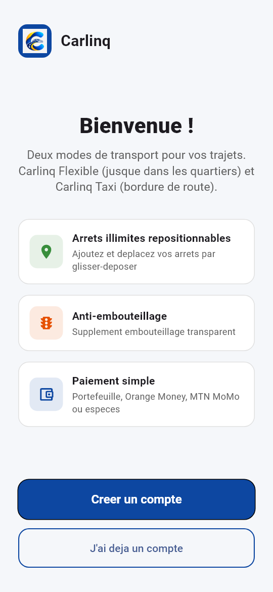 |
| Inscription passager (2 étapes : identité, consentement) | `features/auth/signup_form_screen.dart` | 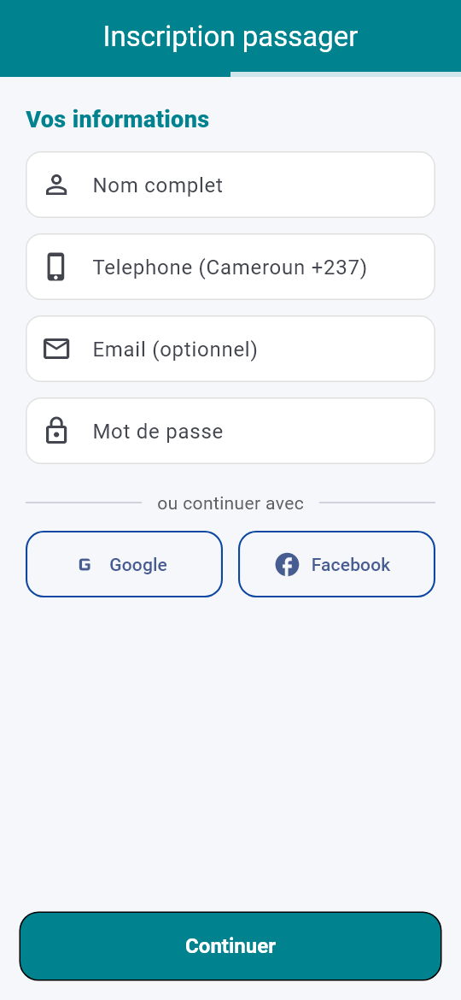 |
| Connexion | `features/auth/login_screen.dart` | 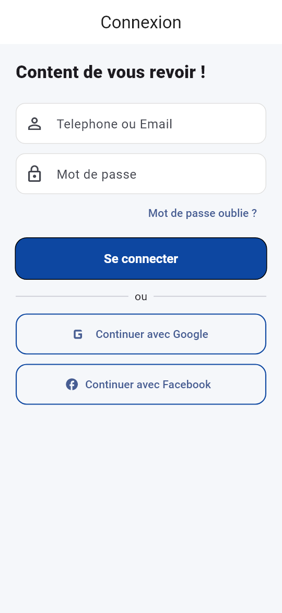 |

## Écrans principaux (§5.1)

| § | Écran | Éléments couverts | Capture |
|---|---|---|---|
| 5.1.1 | Accueil / sélection du mode | Tuiles Flexible / Taxi, carte chauffeurs proches, **Retour maison 1 tap** (règle du mode : domicile exact en Flexible, bordure en Taxi), alerte solde < 500 XAF, notifications | 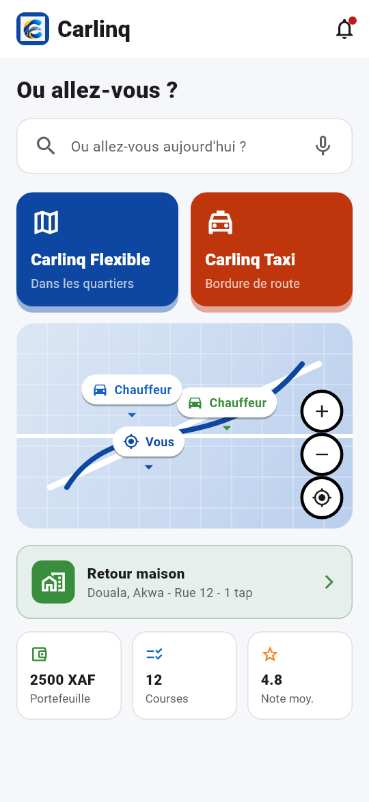 |
| 5.1.2 | Réservation Carlinq Flexible | 3 classes avec icône et tarif, prise en charge domicile (GPS) ou saisie libre, destination, **arrêts illimités réordonnables par glisser-déposer** avec supplément affiché par arrêt, route dégradée auto (+10 %), 1 à 4 places, paiement, détail du prix mis à jour en temps réel | 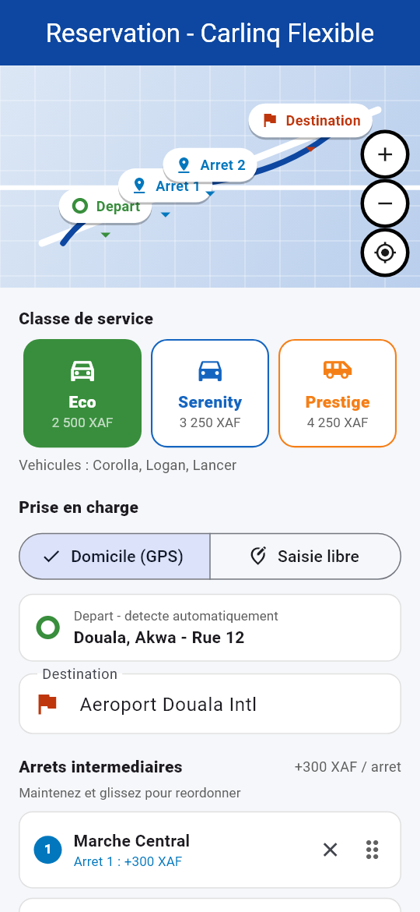 |
| 5.1.3 | Réservation Carlinq Taxi | Zones bordure de route triables (distance / disponibilité), carte, destination, arrêts intermédiaires, places, paiement, détail du prix | 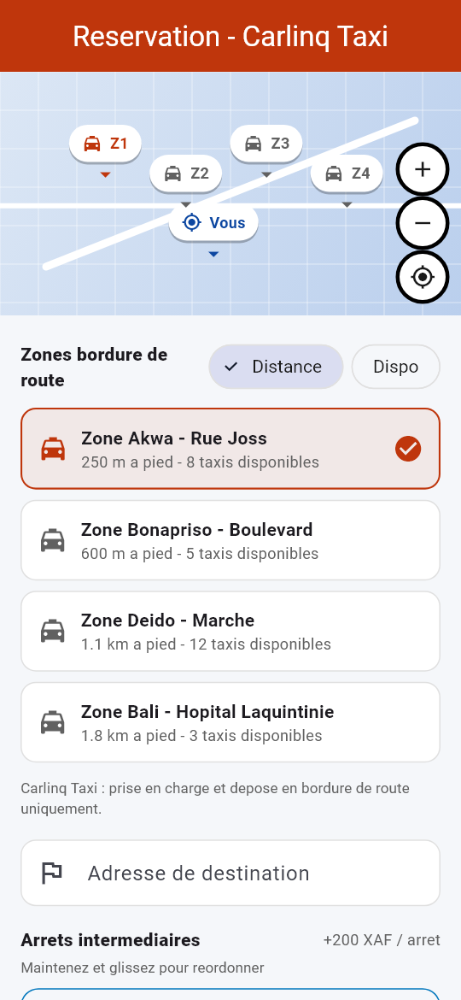 |
| 5.1.4 | Suivi de course temps réel | Fiche chauffeur, chat / appel, minuteur d'arrivée, liste des prochains arrêts, **bandeau embouteillage** (chrono + tolérance 3 min + coût), **bandeau Pause Arrêt** (chrono + supplément), **annulation** gratuite < 15 s ou si chauffeur en retard, sinon avec frais. Menu 🧪 pour simuler les événements | 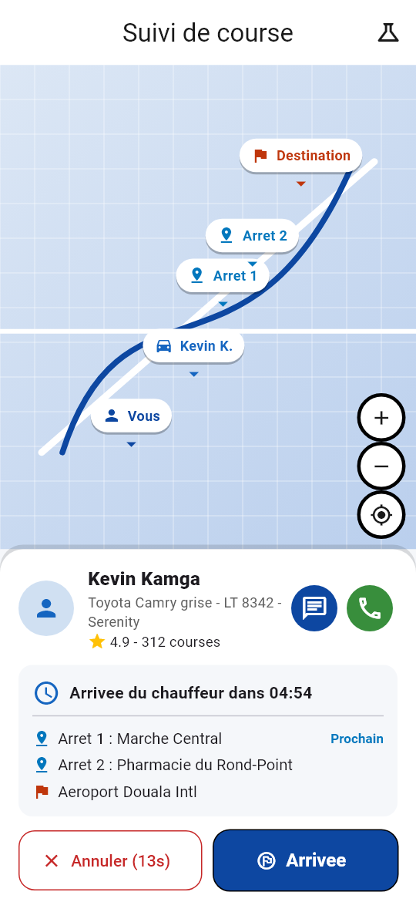 |
| 5.1.5 | Messagerie | Style WhatsApp, texte + photos, réponses rapides, historique rattaché à la course | 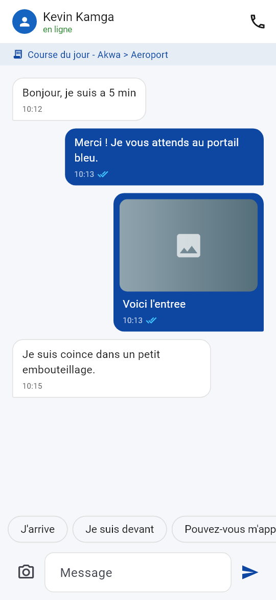 |
| 5.1.6 | Fin de course et notation | Distance / durée, détail complet (base, arrêts pré-déclarés, arrêts impromptus, route dégradée, embouteillage), confirmation du paiement, 1-5 étoiles + tags + commentaire, **contestation Pause Arrêt**, signalement | 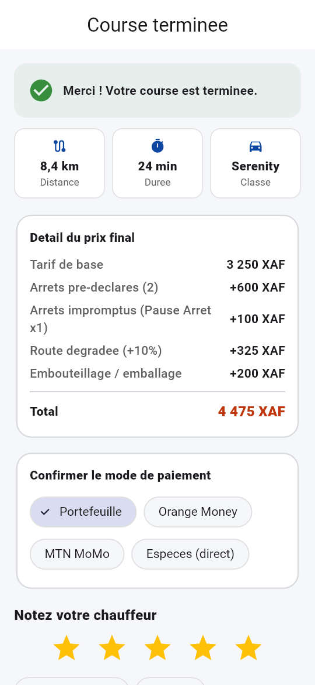 |
| 5.1.7 | Portefeuille | Solde, minimum 500 XAF, recharge Orange Money / MTN MoMo, transactions, relevé | 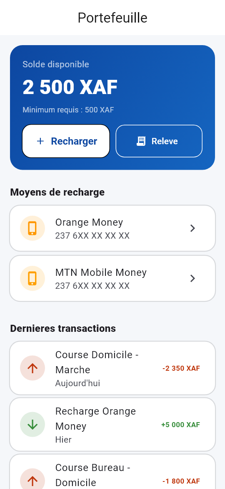 |
| 5.1.8 | Profil / Paramètres | Infos perso, **domicile saisi ou validé GPS**, FR/EN, mode sombre, **gestion des notifications**, déconnexion, **suppression du compte** | 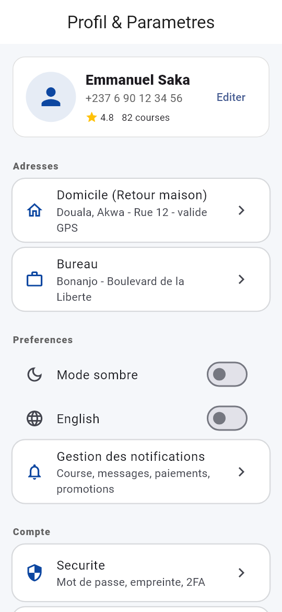 |
| - | Historique | Courses passées par mode / classe | 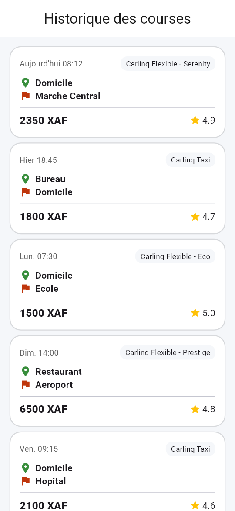 |
| - | Notifications | Centre de notifications + réglages | 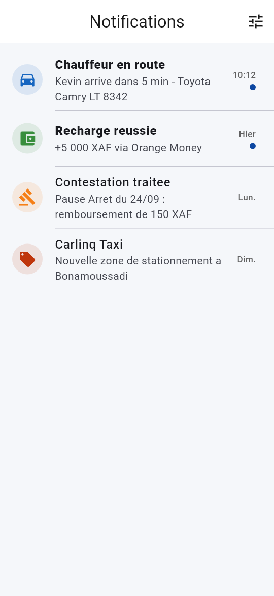 |

# App Chauffeur - Carlinq Chauffeur (`chauffeur/`)

Une seule app pour les deux profils chauffeur ; la couleur d'accent et la carte « Cota mensuel »
changent selon le rôle (Drivers ou Copilote). Barre de navigation : Tableau de bord · Itinéraires ·
Zones · Revenus · Profil.

## Entrée dans l'app

| Écran | Fichier | Capture |
|---|---|---|
| Bienvenue chauffeur | `features/auth/welcome_screen.dart` | 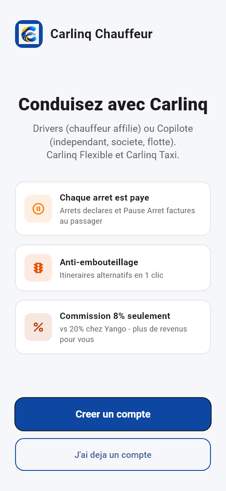 |
| Choix du profil (Drivers / Copilote) | `features/auth/signup_role_screen.dart` | 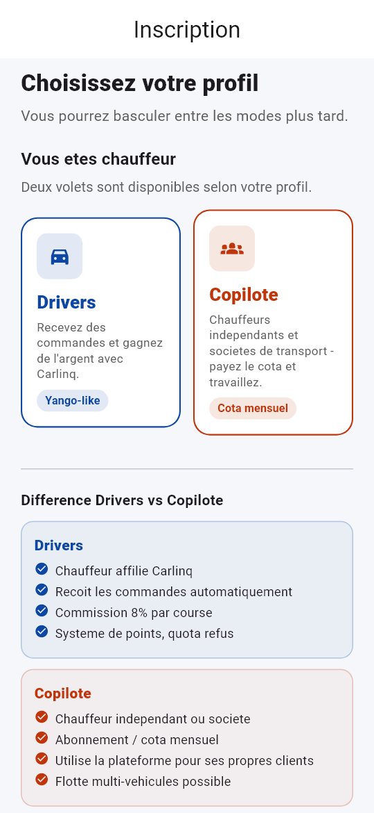 |
| Inscription Copilote (3 étapes, cota 5 000 XAF) | `features/auth/signup_form_screen.dart` | 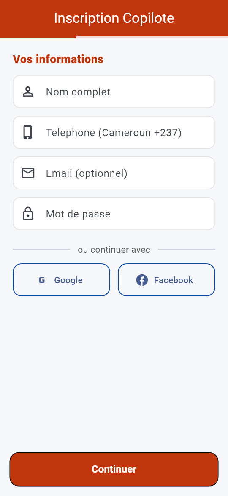 |
| Connexion (Drivers / Copilote) | `features/auth/login_screen.dart` | 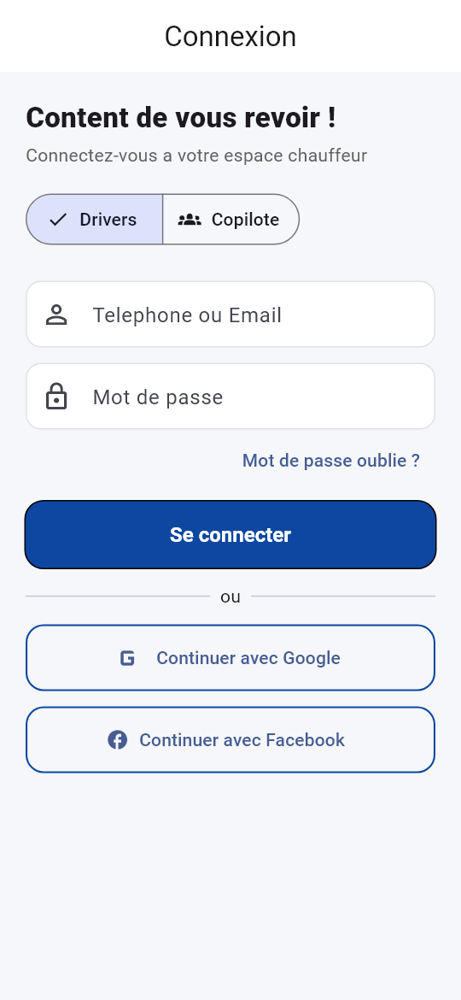 |
| **Validation en attente** (validation admin obligatoire avant activation) | `features/auth/pending_validation_screen.dart` | 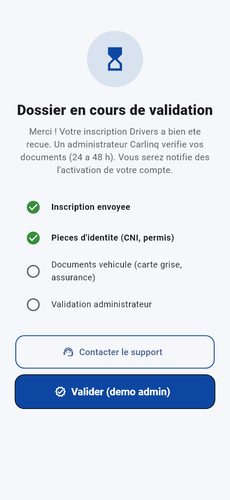 |

## Écrans principaux (§5.2)

| § | Écran | Éléments couverts | Capture |
|---|---|---|---|
| 5.2.1 | Tableau de bord | **Mode actif** (Flexible + classe / Taxi), en ligne / hors ligne, score de points (jauge), objectif hebdo, revenus jour / semaine, **quota de refus restant** (dynamique), commande entrante, Retour maison | 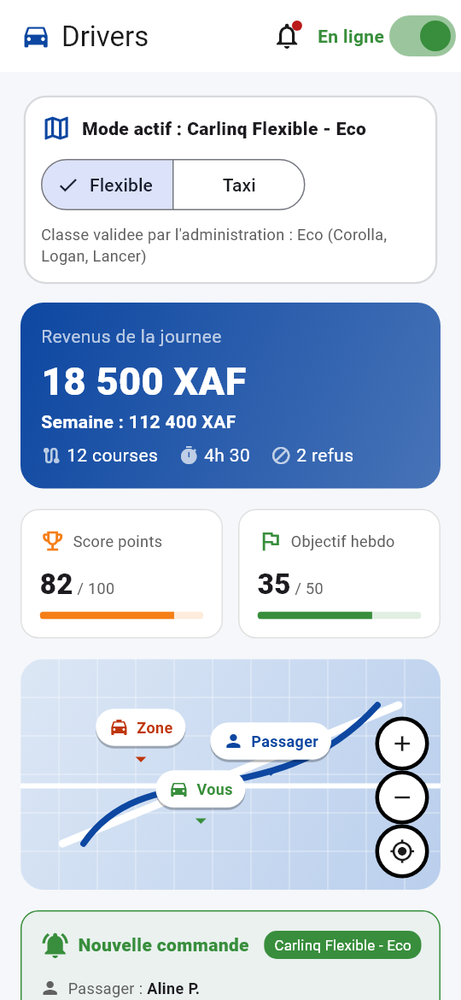 |
| 5.2.1 | Tableau de bord Copilote | + carte Pack Premium (5 000 XAF/mois) | 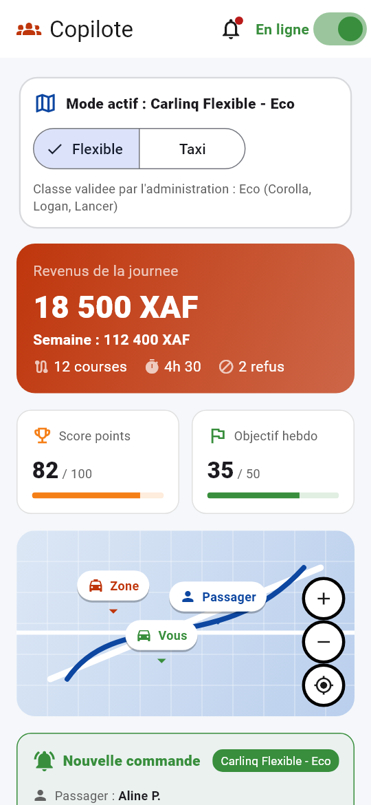 |
| 5.2.2 | Réception de commande | Mode, classe, places, arrêts pré-déclarés + supplément, montant net après 8 %, **minuteur 20 s** réel (expiration auto), quota de refus ; refus au-delà du quota = −5 points | 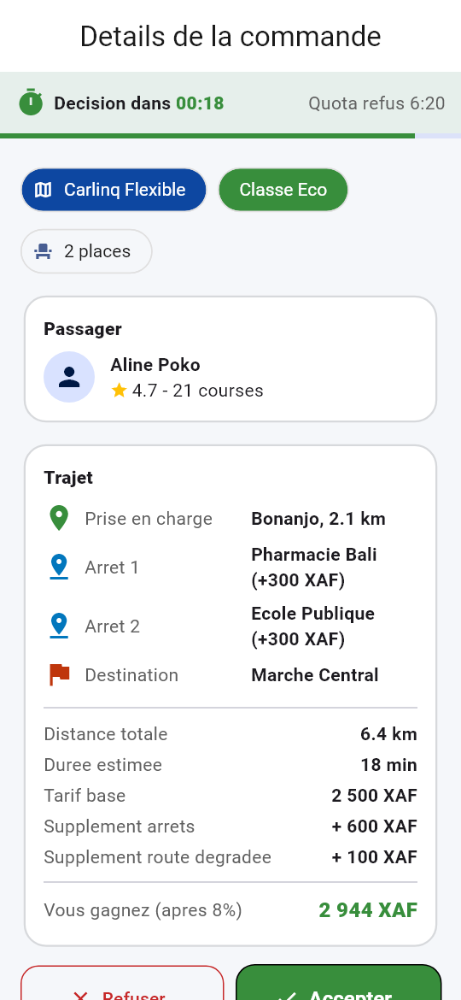 |
| 5.2.3 | Navigation active | Carte + arrêts avec statut (en attente / passé / valider), **Embouteillage → 3 itinéraires alternatifs** + compteur, **Pause Arrêt** avec chrono et supplément, localiser le passager, messagerie, **signaler route dégradée** (niveaux +5/10/15 %), Démarrer / Terminer, Retour maison | 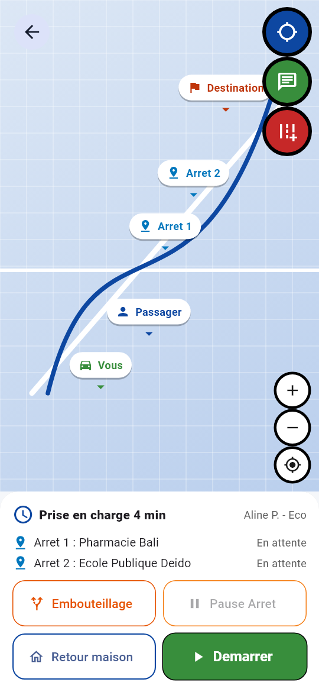 |
| 5.2.4 | Itinéraires personnalisés | 3 slots identifiés, compteur x/3, tracer / remplacer / supprimer, distance et durée, remise à zéro à minuit | 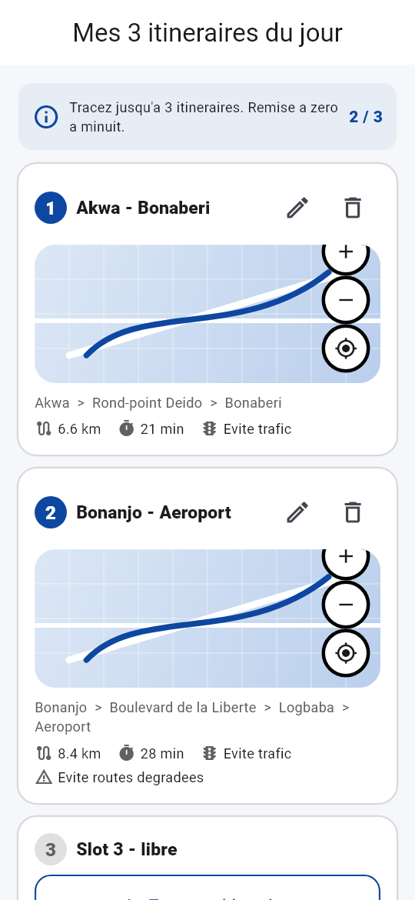 |
| 5.2.4 | Tracé d'un itinéraire | Départ, étapes réordonnables, destination, évitement trafic / routes dégradées | 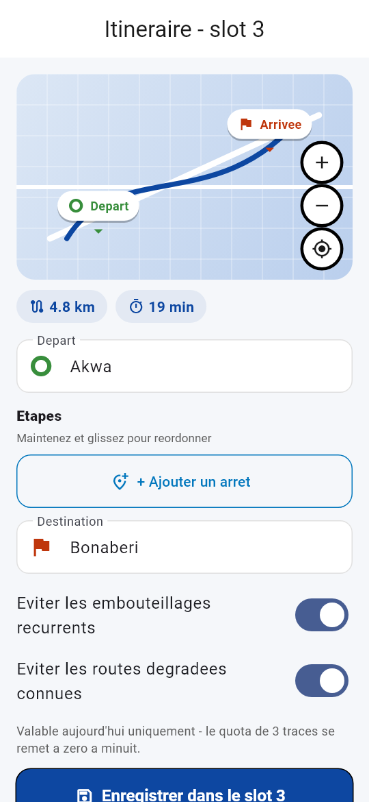 |
| 5.2.5 | **Retour maison chauffeur** | Itinéraire vers le domicile, règle Flexible (jusqu'au domicile) / Taxi (bordure du quartier), mode anti-embouteillage sur le retour (3 alternatives) | 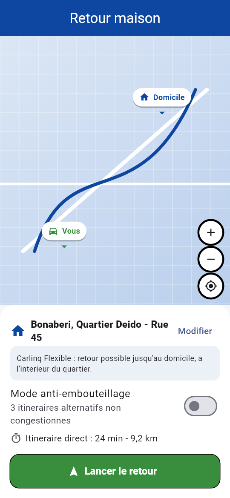 |
| 5.2.6 | **Zones de stationnement** | Liste + carte, filtre par quartier, tri distance / places libres, capacité, disponibilité, horaires | 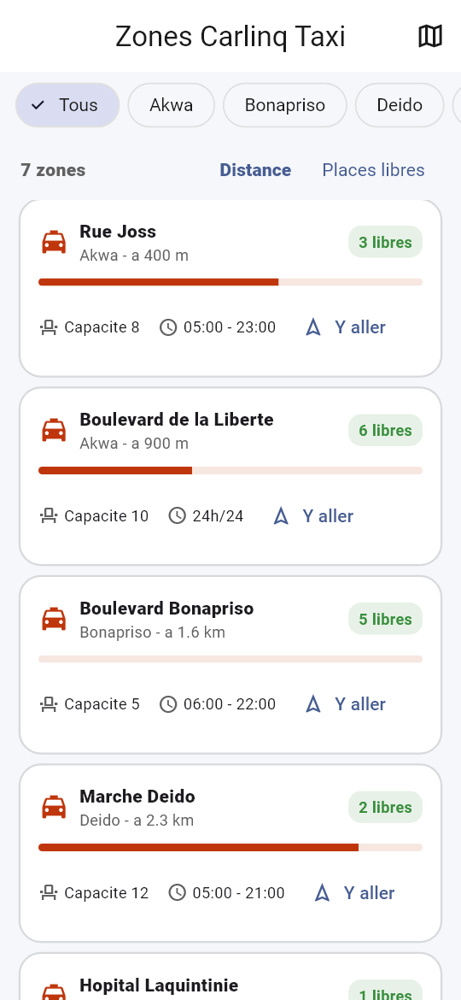 |
| 5.2.7 | Profil chauffeur | Mode et classe actifs, véhicule, documents + statut de validation + soumission, domicile modifiable, **Pack Premium**, notifications, suppression du compte | 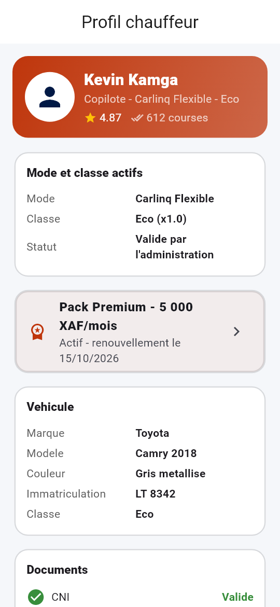 |
| - | Revenus & objectifs | Revenus jour / semaine / mois, objectif hebdo (paliers, pause 72 h), score de points | 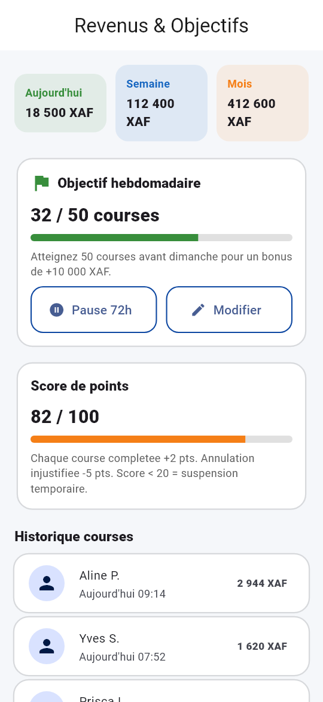 |
| - | Fin de course chauffeur | Gains nets après commission 8 %, +2 points, **notation du passager**, enchaînement Retour maison | 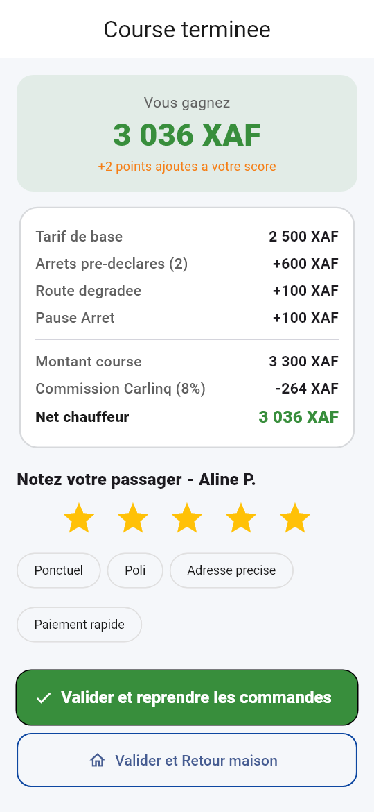 |
| - | Pack Premium | Souscription / renouvellement 5 000 XAF/mois, moyen de paiement, factures | 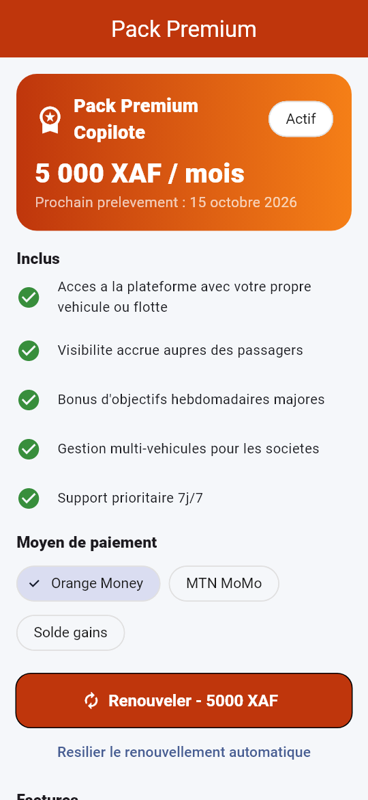 |

## Règles métier reflétées dans les maquettes

- Commission plateforme : **8 %** (affichée côté chauffeur uniquement).
- Montants toujours en **entiers XAF** (`xaf()` de `carlinq_core` formate `12 500 XAF`).
- Portefeuille minimum **500 XAF** : paiement « Portefeuille » bloqué et alerte à l'accueil en dessous.
- Points chauffeur : +2 par course terminée, −5 par refus hors quota ; fenêtre de refus quotidienne (démo : 6 min 20 s, −1 min par refus).
- Inscription Drivers / Copilote : écran « validation en attente » avant activation (le bouton « Valider (démo admin) » n'existe que pour la démo).
